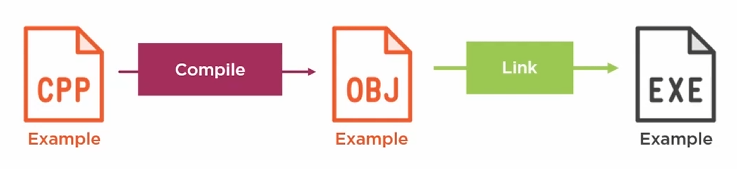

1. Start with a source file `example.cpp`.
2. Compilation will turn `example.cpp` into an object file `example.obj`. Each `cpp` file is compiled into an `obj` file.
3. The object files are linked to form an executable `example.exe`.

If only one file changes, you only have to recompile the one file that changed and link the new obj with the already linked obj's. This cuts down the build time significantly.

You could have libraries that are linked in which never need to be compiled.